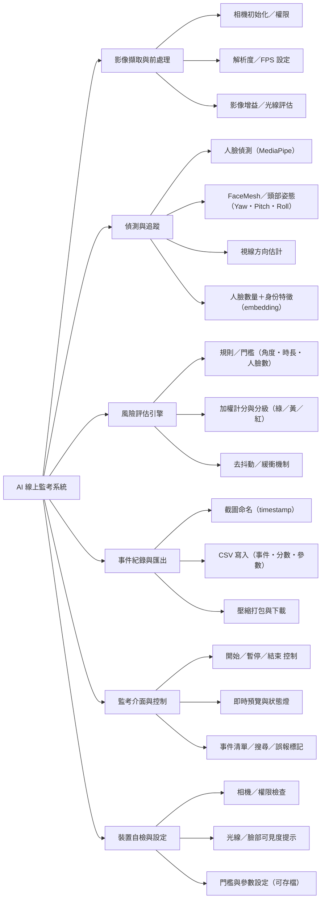
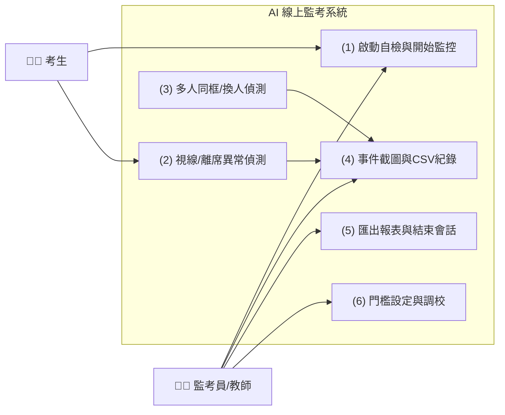

# 功能性需求（Functional Requirements）

### **1.即時人臉與頭部姿態偵測**  
透過 MediaPipe Face Detection / Face Mesh 擷取臉部關鍵點，估計頭部姿態（Pitch/Yaw/Roll）以判斷是否過度偏頭或低頭。

### **2.視線偏移與螢幕離視判定**  
以眼睛關鍵點向量估算視線方向；當連續 N 秒偏離螢幕（或臉部消失）即標記為可疑事件。

### **3.多人同框／換人偵測**  
檢測畫面人臉數量與臉嵌入特徵，若出現第二張臉或臉部身份快速切換，觸發「多人同框／換人」警示。

### **4.風險分數計算與分級警示**  
依頭部角度門檻、視線偏離時長、人臉數量、頻繁遮擋等指標加權計分，分級顯示綠／黃／紅狀態。

### **5.事件截圖與紀錄輸出**  
發生警示時自動截圖並記錄時間戳、事件類型、分數、關鍵參數（角度、臉數、持續秒數）至 CSV，截圖以 PNG/JPG 存檔。

### **6.互動式監控介面與控制**  
於 Colab / Jupyter（ipywidgets）提供「開始／暫停／結束」監控按鈕、門檻調整滑桿、下載紀錄／截圖打包按鈕。

### **7.考生裝置端自檢**  
開考前執行相機可用性、解析度、光線／臉部可見度檢查並提示改善建議。

---

# 非功能性需求（Non-Functional Requirements）

### **1.效能／即時性**  
在 720p 解析度下，單機推論達 ≥15 FPS；事件判定／顯示延遲 ≤500ms。

### **2.準確性**  
頭部角度估計 MAE ≤8°、多人同框偵測 Precision ≥0.9；所有閾值可參數化調整。

### **3.穩定性與容錯**  
短暫相機中斷或臉部遺失 ≤3s 不中止考試，採退避重試與狀態回復；異常持續則提示監考員。

### **4.隱私與資料保護**  
僅於本機記錄事件與截圖；檔案具時間戳命名；可選擇自動匿名化（臉部模糊化）匯出。

### **5.可用性**  
介面支援中文標籤與工具提示；一鍵下載 CSV 與截圖壓縮包。

### **6.可移植性**  
以 Python + OpenCV + MediaPipe 開發，支援 Google Colab 與一般筆電相機；無需額外硬體。

---

 # 使用案例說明（Use Case Specifications）

 ## （一）啟動監控與考前自檢

### **主要參與者**  
監考員（教師）

### **利害關係人與目標**  
- 監考員：確認裝置、光線、相機正常，設定門檻後開始監控。  
- 系統：完成相機初始化與自檢，進入即時分析。

### **前置條件**  
已開啟 Colab Notebook／Web 介面，相機權限允許。

### **主要流程**  
1. 監考員點擊「開始自檢」。  
2. 系統測試相機解析度、FPS、臉部可見度與亮度。  
3. 若未達標，顯示改善建議（移動位置／調整光線）。  
4. 監考員設定門檻（角度、視線時長、人臉數上限）。  
5. 監考員點擊「開始監控」，系統進入即時分析。

## **例外流程**  
相機不可用 → 提示更換裝置或重新授權；仍不可用則禁止開始。

### **後置條件**  
監控會話建立，起始時間寫入紀錄檔。

---

## （二）視線偏移／離席異常偵測與記錄

### **主要參與者**  
考生、系統

### **利害關係人與目標**  
- 監考員：快速掌握離視／離席事件與證據。  
- 系統：穩定估算視線方向並在門檻內回報。

### **前置條件**  
監控進行中，臉部關鍵點可辨識。

### **主要流程**  
1. 系統持續追蹤臉部與眼睛向量。  
2. 連續超過 `T_gaze` 秒偏離螢幕或臉部消失。  
3. 計算風險分數並提升為黃／紅燈。  
4. 自動截圖，寫入 CSV（時間戳、事件、角度／時長、分數、檔名）。  
5. 在介面事件列即時顯示。

### **例外流程**  
光線驟變導致關鍵點遺失 → 短暫緩衝（≤3s）後再判定。

### **後置條件**  
事件被記錄並可於會後報表查看。

---

## （三）多人同框／換人偵測

### **主要參與者**  
系統、監考員

### **利害關係人與目標**  
- 監考員：第一時間得知是否有他人出現或換人應考。  
- 系統：以人臉數量與嵌入特徵比對偵測異常。

### **前置條件**  
監控進行中；基準臉已建立（開考時的人臉特徵）。

### **主要流程**  
1. 每幀計算人臉數量與臉嵌入向量。  
2. 若人臉數 > 1 或與基準臉距離超過門檻。  
3. 觸發紅燈警示、（選配）聲響通知。  
4. 連拍數張證據截圖並寫入 CSV。  
5. 介面置頂顯示「多人同框／換人」標籤。

### **例外流程**  
背景照片／螢幕反射造成誤判 → 監考員可手動標記為誤報（供之後模型調整）。

### **後置條件**  
高風險事件被保存與標註。

---

## （四）匯出報表與結束會話

### **主要參與者**  
監考員

### **利害關係人與目標**  
監考員：一鍵取得 CSV + 截圖壓縮包，便於送審／存檔。

### **前置條件**  
監控會話仍在或已結束；檔案存在。

### **主要流程**  
1. 監考員點擊「下載報表」。  
2. 系統彙整 CSV 與所有截圖為壓縮包。  
3. 提供下載連結（Colab：files.download／Web：`<a download>`）。  
4. 顯示會話摘要（總時長、事件數、紅燈事件清單）。

### **例外流程**  
檔案過大 → 分卷或僅匯出事件精選截圖。

### **後置條件**  
會話狀態標記為已結束；日誌寫入完成。

# 功能分解圖（Functional Decomposition Diagram, FDD）

# 使用案例圖（Use Case Diagram)

