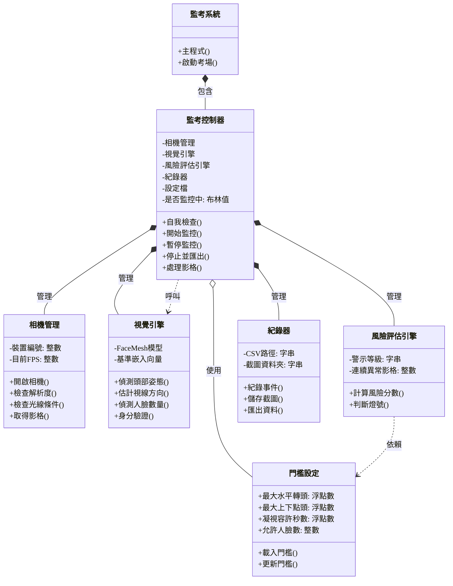

```mermaid
%%{init:{
  "themeVariables":{
    "fontFamily":"Noto Sans TC, Microsoft JhengHei, system-ui",
    "fontSize":"16px"
  }
}}%%
classDiagram

class ProctoringSystem["監考系統"] {
  +主程式()
  +啟動考場()
}

class ProctoringController["監考控制器"] {
  -相機管理
  -視覺引擎
  -風險評估引擎
  -紀錄器
  -設定檔
  -是否監控中: 布林值
  +自我檢查()
  +開始監控()
  +暫停監控()
  +停止並匯出()
  +處理影格()
}

class Config["門檻設定"] {
  +最大水平轉頭: 浮點數
  +最大上下點頭: 浮點數
  +凝視容許秒數: 浮點數
  +允許人臉數: 整數
  +載入門檻()
  +更新門檻()
}

class CameraManager["相機管理"] {
  -裝置編號: 整數
  -目前FPS: 整數
  +開啟相機()
  +檢查解析度()
  +檢查光線條件()
  +取得影格()
}

class VisionEngine["視覺引擎"] {
  -FaceMesh模型
  -基準嵌入向量
  +偵測頭部姿態()
  +估計視線方向()
  +偵測人臉數量()
  +身分驗證()
}

class RiskAssessmentEngine["風險評估引擎"] {
  -警示等級: 字串
  -連續異常影格: 整數
  +計算風險分數()
  +判斷燈號()
}

class Recorder["紀錄器"] {
  -CSV路徑: 字串
  -截圖資料夾: 字串
  +紀錄事件()
  +儲存截圖()
  +匯出資料()
}

%% 關係
ProctoringSystem *-- ProctoringController : 包含
ProctoringController *-- CameraManager : 管理
ProctoringController *-- VisionEngine : 管理
ProctoringController *-- RiskAssessmentEngine : 管理
ProctoringController *-- Recorder : 管理
ProctoringController o-- Config : 使用
RiskAssessmentEngine ..> Config : 依賴
ProctoringController ..> VisionEngine : 呼叫

```
