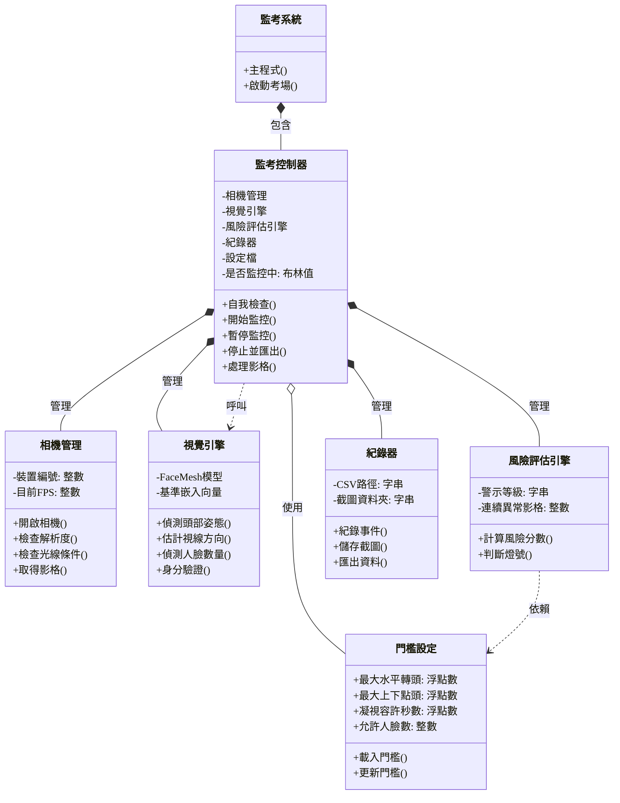
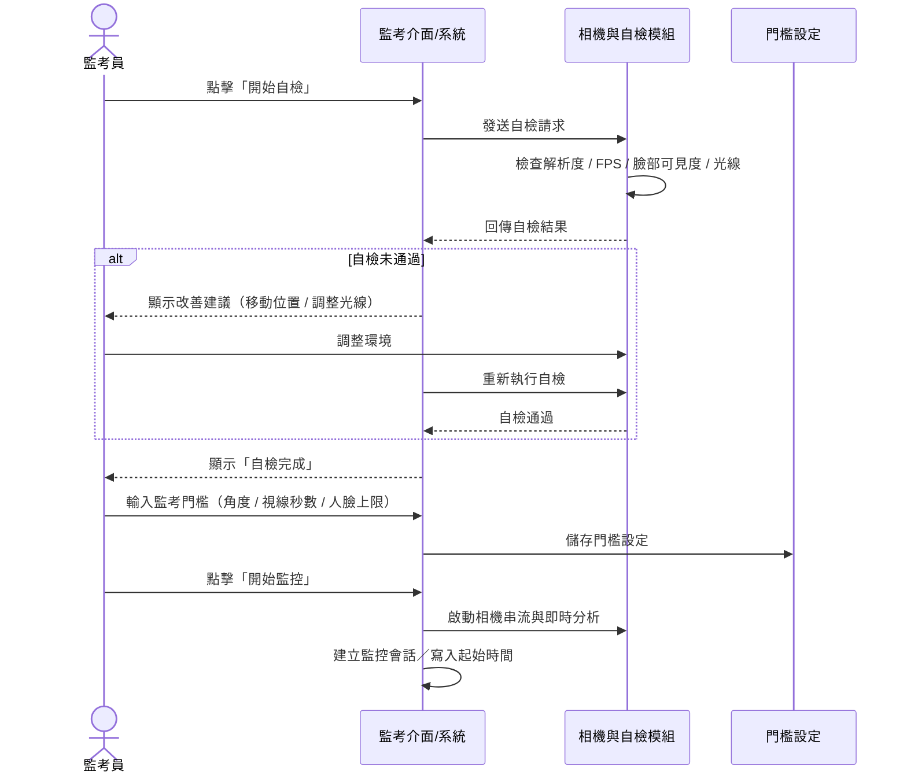
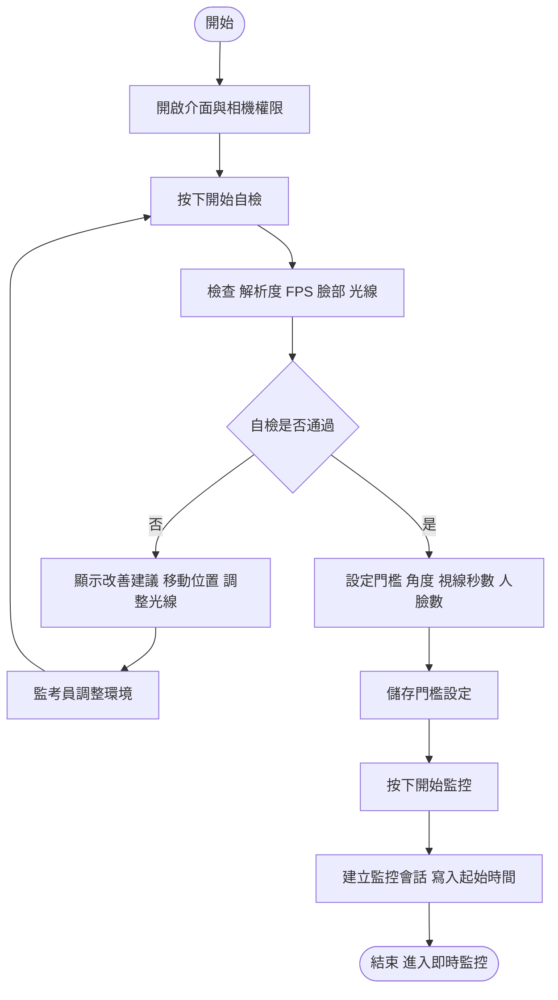
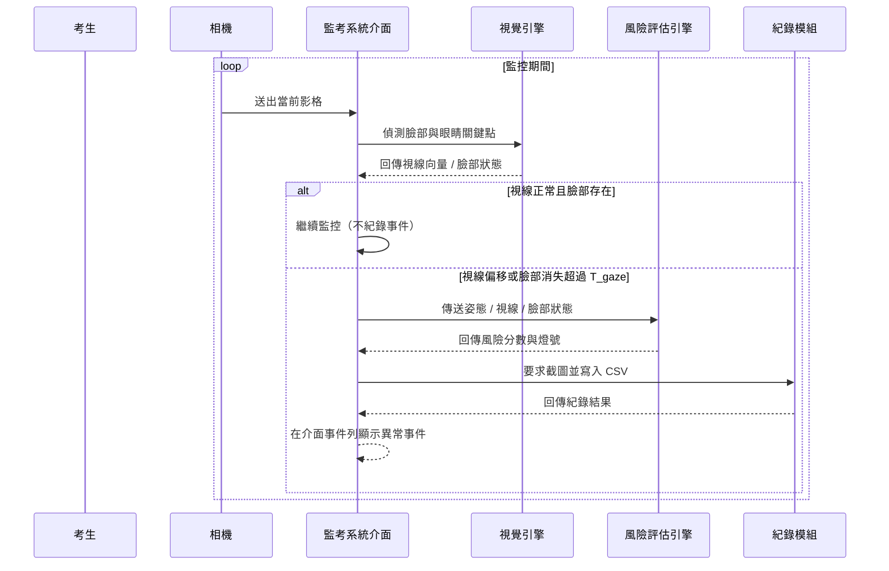
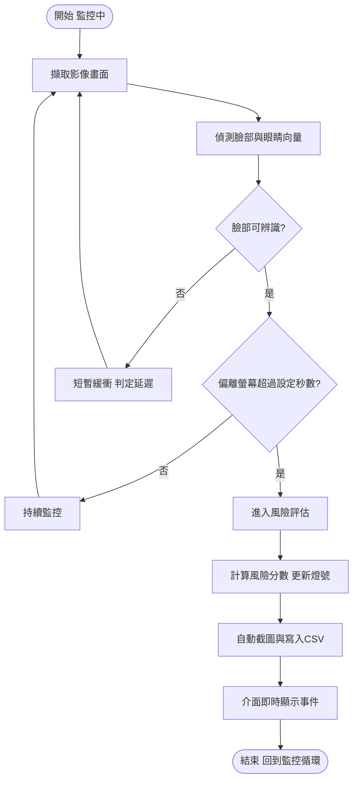
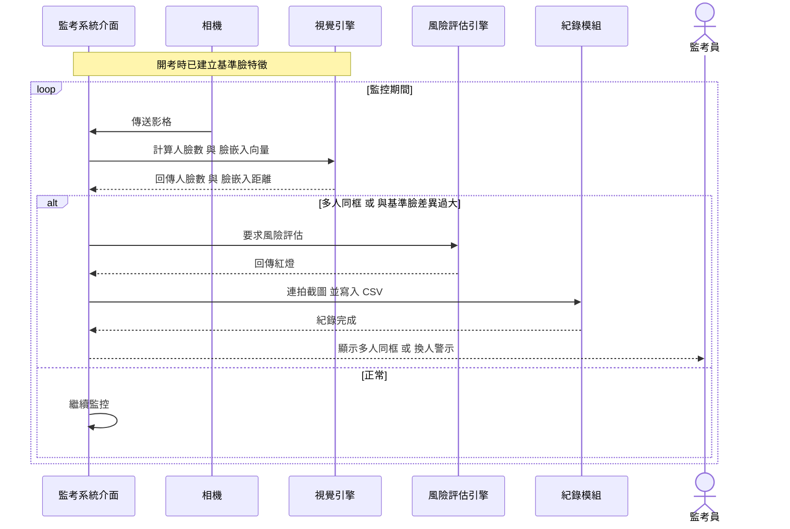
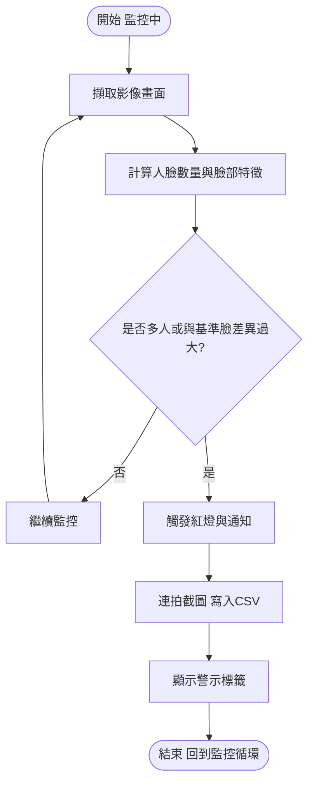

## UML 類別圖

```mermaid
%%{init:{
  "themeVariables":{
    "fontFamily":"Noto Sans TC, Microsoft JhengHei, system-ui",
    "fontSize":"16px"
  }
}}%%
classDiagram

class ProctoringSystem["監考系統"] {
  +主程式()
  +啟動考場()
}

class ProctoringController["監考控制器"] {
  -相機管理
  -視覺引擎
  -風險評估引擎
  -紀錄器
  -設定檔
  -是否監控中: 布林值
  +自我檢查()
  +開始監控()
  +暫停監控()
  +停止並匯出()
  +處理影格()
}

class Config["門檻設定"] {
  +最大水平轉頭: 浮點數
  +最大上下點頭: 浮點數
  +凝視容許秒數: 浮點數
  +允許人臉數: 整數
  +載入門檻()
  +更新門檻()
}

class CameraManager["相機管理"] {
  -裝置編號: 整數
  -目前FPS: 整數
  +開啟相機()
  +檢查解析度()
  +檢查光線條件()
  +取得影格()
}

class VisionEngine["視覺引擎"] {
  -FaceMesh模型
  -基準嵌入向量
  +偵測頭部姿態()
  +估計視線方向()
  +偵測人臉數量()
  +身分驗證()
}

class RiskAssessmentEngine["風險評估引擎"] {
  -警示等級: 字串
  -連續異常影格: 整數
  +計算風險分數()
  +判斷燈號()
}

class Recorder["紀錄器"] {
  -CSV路徑: 字串
  -截圖資料夾: 字串
  +紀錄事件()
  +儲存截圖()
  +匯出資料()
}

%% 關係
ProctoringSystem *-- ProctoringController : 包含
ProctoringController *-- CameraManager : 管理
ProctoringController *-- VisionEngine : 管理
ProctoringController *-- RiskAssessmentEngine : 管理
ProctoringController *-- Recorder : 管理
ProctoringController o-- Config : 使用
RiskAssessmentEngine ..> Config : 依賴
ProctoringController ..> VisionEngine : 呼叫

```
# 一、啟動監控與考前自檢
## 使用案例1 循序圖

```mermaid
sequenceDiagram
    actor T as 監考員
    participant UI as 監考介面/系統
    participant Cam as 相機與自檢模組
    participant Cfg as 門檻設定

    T ->> UI: 點擊「開始自檢」
    UI ->> Cam: 發送自檢請求
    Cam ->> Cam: 檢查解析度 / FPS / 臉部可見度 / 光線
    Cam -->> UI: 回傳自檢結果

    alt 自檢未通過
        UI -->> T: 顯示改善建議（移動位置 / 調整光線）
        T ->> Cam: 調整環境
        UI ->> Cam: 重新執行自檢
        Cam -->> UI: 自檢通過
    end

    UI -->> T: 顯示「自檢完成」

    T ->> UI: 輸入監考門檻（角度 / 視線秒數 / 人臉上限）
    UI ->> Cfg: 儲存門檻設定

    T ->> UI: 點擊「開始監控」
    UI ->> Cam: 啟動相機串流與即時分析
    UI ->> UI: 建立監控會話／寫入起始時間
```

## 使用案例1 活動圖

```mermaid
flowchart TD
  s0([開始])
  s1[開啟介面與相機權限]
  s2[按下開始自檢]
  s3[檢查 解析度 FPS 臉部 光線]
  s4{自檢是否通過}
  s5[顯示改善建議 移動位置 調整光線]
  s6[監考員調整環境]
  s7[設定門檻 角度 視線秒數 人臉數]
  s8[儲存門檻設定]
  s9[按下開始監控]
  s10[建立監控會話 寫入起始時間]
  s11([結束 進入即時監控])

  s0 --> s1 --> s2 --> s3 --> s4
  s4 -->|否| s5 --> s6 --> s2
  s4 -->|是| s7 --> s8 --> s9 --> s10 --> s11
```
# 二、視線偏移／離席異常偵測與記錄
## 使用案例2 循序圖

```mermaid
sequenceDiagram
    participant S as 考生
    participant Cam as 相機
    participant UI as 監考系統介面
    participant Vis as 視覺引擎
    participant Risk as 風險評估引擎
    participant Rec as 紀錄模組

    loop 監控期間
        Cam ->> UI: 送出當前影格
        UI ->> Vis: 偵測臉部與眼睛關鍵點
        Vis -->> UI: 回傳視線向量 / 臉部狀態

        alt 視線正常且臉部存在
            UI ->> UI: 繼續監控（不紀錄事件）
        else 視線偏移或臉部消失超過 T_gaze
            UI ->> Risk: 傳送姿態 / 視線 / 臉部狀態
            Risk -->> UI: 回傳風險分數與燈號
            UI ->> Rec: 要求截圖並寫入 CSV
            Rec -->> UI: 回傳紀錄結果
            UI -->> UI: 在介面事件列顯示異常事件
        end
    end
```
## 使用案例2 活動圖

```mermaid
flowchart TD
  s0([開始 監控中])
  s1[擷取影像畫面]
  s2[偵測臉部與眼睛向量]
  s3{臉部可辨識?}
  s4{偏離螢幕超過設定秒數?}
  s5[持續監控]
  s6[短暫緩衝 判定延遲]
  s7[進入風險評估]
  s8[計算風險分數 更新燈號]
  s9[自動截圖與寫入CSV]
  s10[介面即時顯示事件]
  s11([結束 回到監控循環])

  s0 --> s1 --> s2 --> s3

  s3 -->|否| s6 --> s1
  s3 -->|是| s4
  s4 -->|否| s5 --> s1
  s4 -->|是| s7 --> s8 --> s9 --> s10 --> s11
```
# 三、多人同框／換人偵測
## 使用案例3 循序圖

```mermaid
sequenceDiagram
    participant UI as 監考系統介面
    participant Cam as 相機
    participant Vis as 視覺引擎
    participant Risk as 風險評估引擎
    participant Rec as 紀錄模組
    actor T as 監考員

    Note over UI,Vis: 開考時已建立基準臉特徵

    loop 監控期間
        Cam ->> UI: 傳送影格
        UI ->> Vis: 計算人臉數 與 臉嵌入向量
        Vis -->> UI: 回傳人臉數 與 臉嵌入距離

        alt 多人同框 或 與基準臉差異過大
            UI   ->> Risk: 要求風險評估
            Risk -->> UI: 回傳紅燈
            UI   ->> Rec: 連拍截圖 並寫入 CSV
            Rec  -->> UI: 紀錄完成
            UI  -->> T: 顯示多人同框 或 換人警示
        else 正常
            UI ->> UI: 繼續監控
        end
    end
```
## 使用案例3 活動圖

```mermaid
flowchart TD
  s0([開始 監控中])
  s1[擷取影像畫面]
  s2[計算人臉數量與臉部特徵]
  s3{是否多人或與基準臉差異過大?}
  s4[繼續監控]
  s5[觸發紅燈與通知]
  s6[連拍截圖 寫入CSV]
  s7[顯示警示標籤]
  s8([結束 回到監控循環])

  s0 --> s1 --> s2 --> s3
  s3 -->|否| s4 --> s1
  s3 -->|是| s5 --> s6 --> s7 --> s8
```

