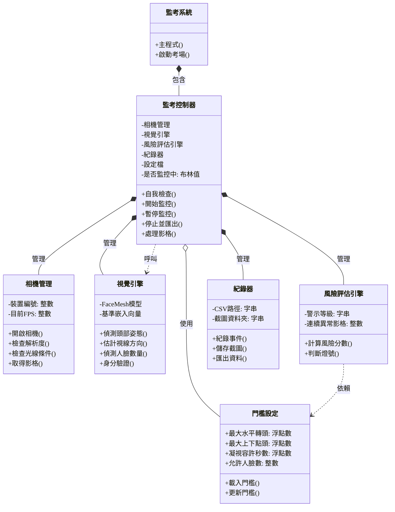
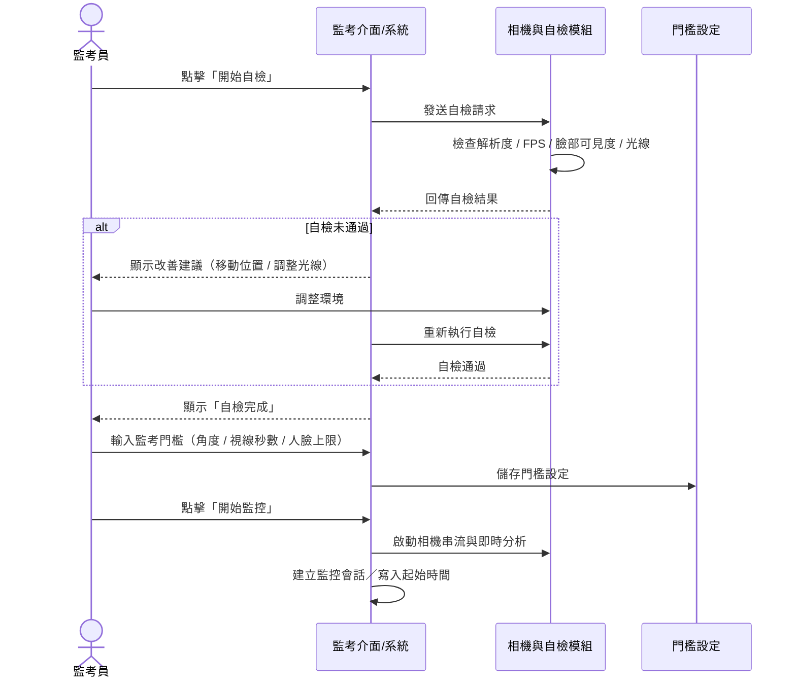

## UML 類別圖

## 使用案例1 循序圖


## 使用案例1 活動圖
```mermaid
flowchart TD
    A([開始]) --> B[開啟 Colab / Web 介面\n取得相機權限]
    B --> C[監考員點擊「開始自檢」]
    C --> D[系統檢查解析度、FPS、臉部可見度、光線]

    D --> E{自檢是否通過？}

    E -->|否| F[顯示改善建議\n(移動位置 / 調整光線)]
    F --> G[監考員調整環境]
    G --> C

    E -->|是| H[監考員設定門檻\n(角度 / 視線秒數 / 人臉數)]
    H --> I[系統儲存門檻設定]
    I --> J[監考員點擊「開始監控」]
    J --> K[系統建立監控會話\n寫入起始時間]
    K --> L([結束：進入即時監控])
```


