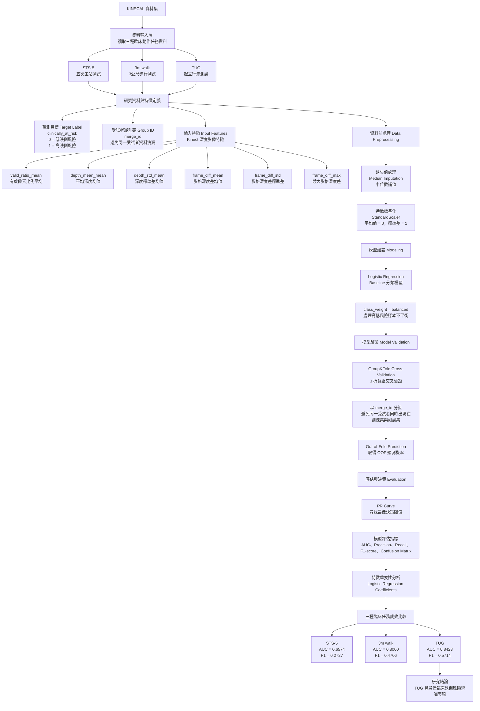

```mermaid
flowchart TD
    A["KINECAL 資料集"] --> B["資料輸入層<br/>讀取三種臨床動作任務資料"]

    B --> B1["STS-5<br/>五次坐站測試"]
    B --> B2["3m walk<br/>3公尺步行測試"]
    B --> B3["TUG<br/>起立行走測試"]

    B1 --> C["研究資料與特徵定義"]
    B2 --> C
    B3 --> C

    C --> C1["預測目標 Target Label<br/>clinically_at_risk<br/>0 = 低跌倒風險<br/>1 = 高跌倒風險"]
    C --> C2["受試者識別碼 Group ID<br/>merge_id<br/>避免同一受試者資料洩漏"]
    C --> C3["輸入特徵 Input Features<br/>Kinect 深度影像特徵"]

    C3 --> F1["valid_ratio_mean<br/>有效像素比例平均"]
    C3 --> F2["depth_mean_mean<br/>平均深度均值"]
    C3 --> F3["depth_std_mean<br/>深度標準差均值"]
    C3 --> F4["frame_diff_mean<br/>影格深度差均值"]
    C3 --> F5["frame_diff_std<br/>影格深度差標準差"]
    C3 --> F6["frame_diff_max<br/>最大影格深度差"]

    C --> D["資料前處理 Data Preprocessing"]
    D --> D1["缺失值處理<br/>Median Imputation<br/>中位數補值"]
    D1 --> D2["特徵標準化<br/>StandardScaler<br/>平均值 = 0，標準差 = 1"]

    D2 --> E["模型建置 Modeling"]
    E --> E1["Logistic Regression<br/>Baseline 分類模型"]
    E1 --> E2["class_weight = balanced<br/>處理高低風險樣本不平衡"]

    E2 --> G["模型驗證 Model Validation"]
    G --> G1["GroupKFold Cross-Validation<br/>3 折群組交叉驗證"]
    G1 --> G2["以 merge_id 分組<br/>避免同一受試者同時出現在訓練集與測試集"]
    G2 --> G3["Out-of-Fold Prediction<br/>取得 OOF 預測機率"]

    G3 --> H["評估與決策 Evaluation"]
    H --> H1["PR Curve<br/>尋找最佳決策閾值"]
    H1 --> H2["模型評估指標<br/>AUC、Precision、Recall、F1-score、Confusion Matrix"]
    H2 --> H3["特徵重要性分析<br/>Logistic Regression Coefficients"]

    H3 --> I["三種臨床任務成效比較"]
    I --> I1["STS-5<br/>AUC = 0.6574<br/>F1 = 0.2727"]
    I --> I2["3m walk<br/>AUC = 0.8000<br/>F1 = 0.4706"]
    I --> I3["TUG<br/>AUC = 0.8423<br/>F1 = 0.5714"]

    I3 --> J["研究結論<br/>TUG 具最佳臨床跌倒風險辨識表現"]
```

