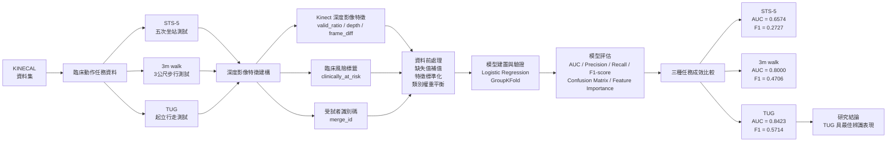

```mermaid
flowchart LR
    A["KINECAL<br/>資料集"] --> B["臨床動作任務資料"]

    B --> B1["STS-5<br/>五次坐站測試"]
    B --> B2["3m walk<br/>3公尺步行測試"]
    B --> B3["TUG<br/>起立行走測試"]

    B1 --> C["深度影像特徵建構"]
    B2 --> C
    B3 --> C

    C --> C1["Kinect 深度影像特徵<br/>valid_ratio / depth / frame_diff"]
    C --> C2["臨床風險標籤<br/>clinically_at_risk"]
    C --> C3["受試者識別碼<br/>merge_id"]

    C1 --> D["資料前處理<br/>缺失值補值<br/>特徵標準化<br/>類別權重平衡"]
    C2 --> D
    C3 --> D

    D --> E["模型建置與驗證<br/>Logistic Regression<br/>GroupKFold"]

    E --> F["模型評估<br/>AUC / Precision / Recall / F1-score<br/>Confusion Matrix / Feature Importance"]

    F --> G["三種任務成效比較"]

    G --> G1["STS-5<br/>AUC = 0.6574<br/>F1 = 0.2727"]
    G --> G2["3m walk<br/>AUC = 0.8000<br/>F1 = 0.4706"]
    G --> G3["TUG<br/>AUC = 0.8423<br/>F1 = 0.5714"]

    G3 --> H["研究結論<br/>TUG 具最佳辨識表現"]
```

