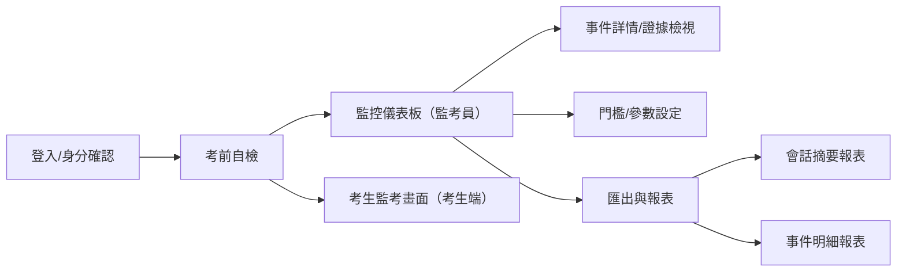
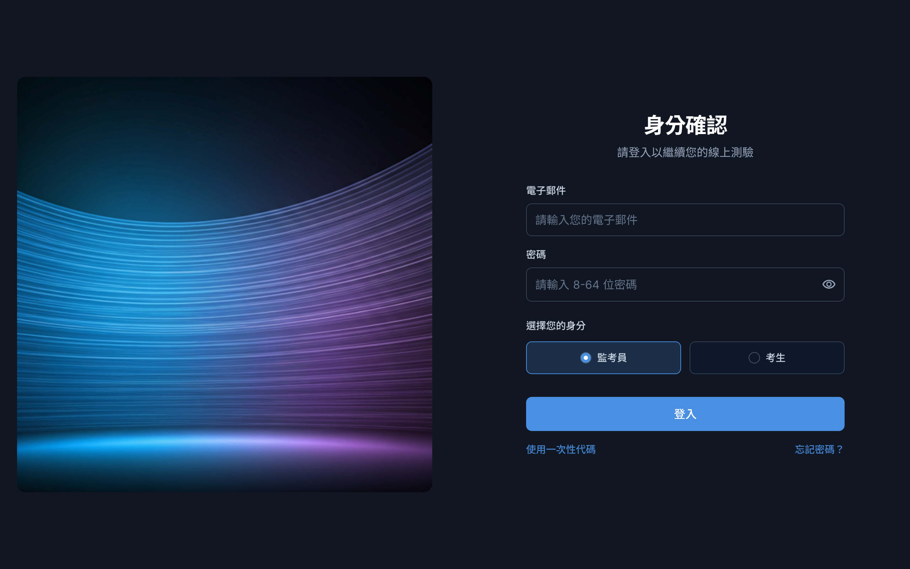
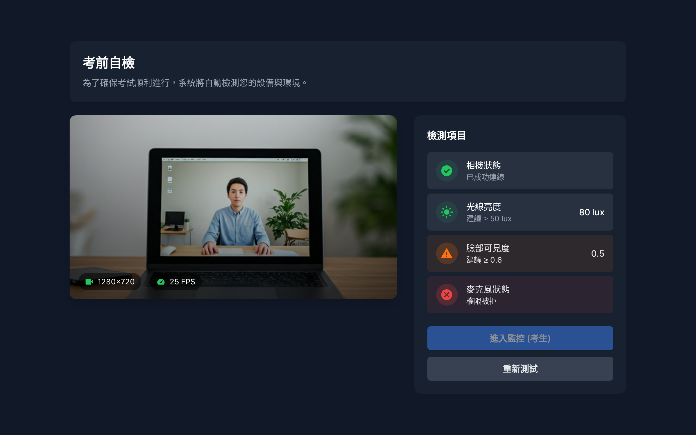
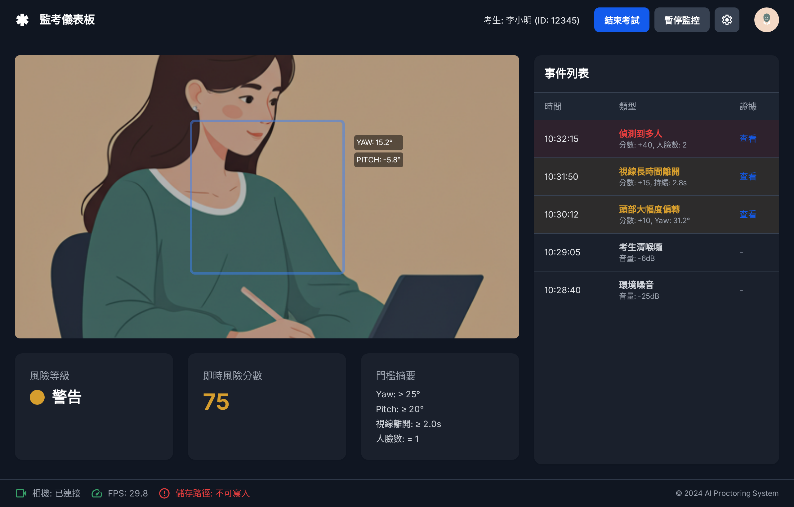
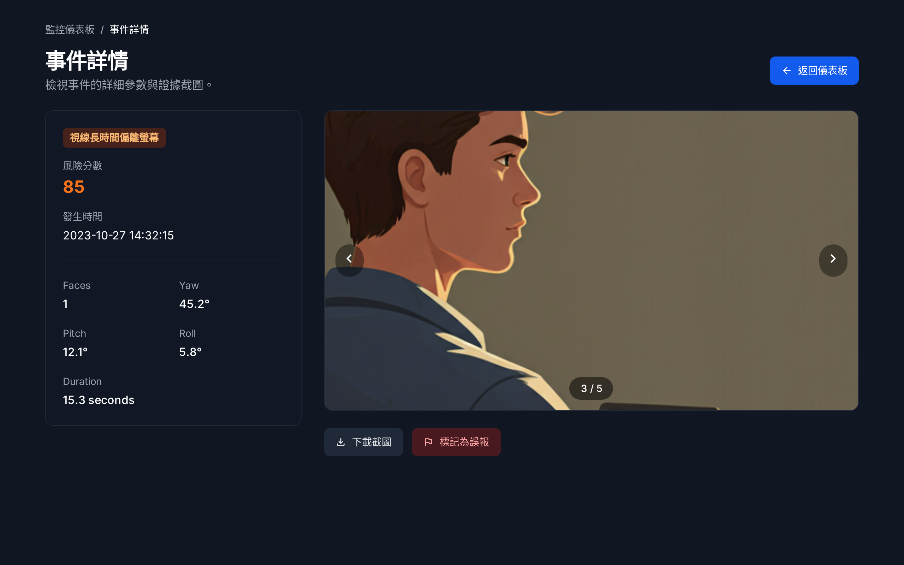

# 流程圖

# 分鏡表
## 【1】登入/身分確認
* 目的：驗證身分與角色，建立會話前置。
* 主要使用者：監考員、考生

## 【2】考前自檢
* 目的：檢測裝置可用性與環境品質
* 主要使用者：監考員、考生

## 【3】監控儀表板（監考員）
* 目的：即時監控、事件列表與狀態掌握
* 主要使用者：監考員

## 【4】事件詳情/證據檢視
* 目的：檢視單一事件之證據與參數
* 來源：儀表板點擊事件
  

