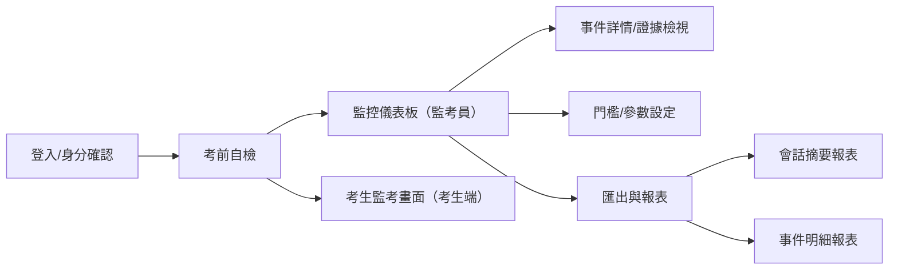
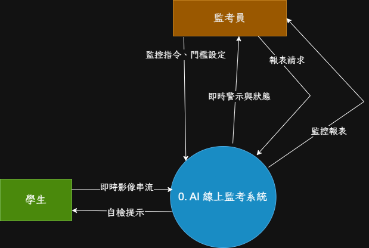

# 流程圖

```mermaid
flowchart LR
  A[登入/身分確認] --> B[考前自檢]
  B --> C[監控儀表板（監考員）]
  B --> S[考生監考畫面（考生端）]
  C --> D[事件詳情/證據檢視]
  C --> E[門檻/參數設定]
  C --> F[匯出與報表]
  F --> G[會話摘要報表]
  F --> H[事件明細報表]
```
# 分鏡表
## 【1】登入/身分確認
目的：驗證身分與角色，建立會話前置。
主要使用者：監考員、考生

