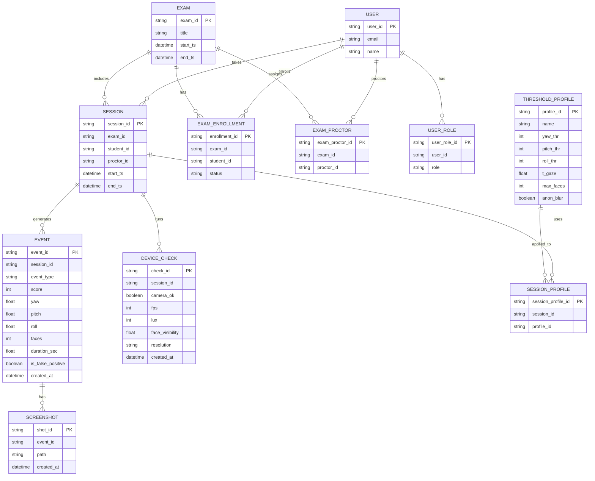

```mermaid
erDiagram
    USER ||--o{ SESSION : takes
    USER ||--o{ EXAM_ENROLLMENT : enrolls
    USER ||--o{ EXAM_PROCTOR : proctors
    USER ||--o{ USER_ROLE : has

    EXAM ||--o{ SESSION : includes
    EXAM ||--o{ EXAM_ENROLLMENT : has
    EXAM ||--o{ EXAM_PROCTOR : assigns

    SESSION ||--o{ EVENT : generates
    SESSION ||--o{ DEVICE_CHECK : runs
    SESSION ||--o{ SESSION_PROFILE : uses

    EVENT ||--o{ SCREENSHOT : has

    THRESHOLD_PROFILE ||--o{ SESSION_PROFILE : applied_to

    USER {
      string user_id PK
      string email
      string name
    }

    USER_ROLE {
      string user_role_id PK
      string user_id
      string role
    }

    EXAM {
      string exam_id PK
      string title
      datetime start_ts
      datetime end_ts
    }

    EXAM_ENROLLMENT {
      string enrollment_id PK
      string exam_id
      string student_id
      string status
    }

    EXAM_PROCTOR {
      string exam_proctor_id PK
      string exam_id
      string proctor_id
    }

    SESSION {
      string session_id PK
      string exam_id
      string student_id
      string proctor_id
      datetime start_ts
      datetime end_ts
    }

    DEVICE_CHECK {
      string check_id PK
      string session_id
      boolean camera_ok
      int fps
      int lux
      float face_visibility
      string resolution
      datetime created_at
    }

    EVENT {
      string event_id PK
      string session_id
      string event_type
      int score
      float yaw
      float pitch
      float roll
      int faces
      float duration_sec
      boolean is_false_positive
      datetime created_at
    }

    SCREENSHOT {
      string shot_id PK
      string event_id
      string path
      datetime created_at
    }

    THRESHOLD_PROFILE {
      string profile_id PK
      string name
      int yaw_thr
      int pitch_thr
      int roll_thr
      float t_gaze
      int max_faces
      boolean anon_blur
    }

    SESSION_PROFILE {
      string session_profile_id PK
      string session_id
      string profile_id
    }
```

